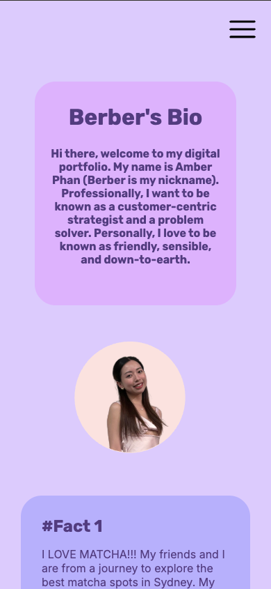
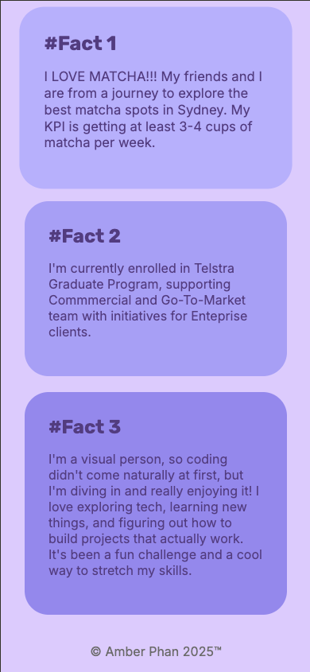
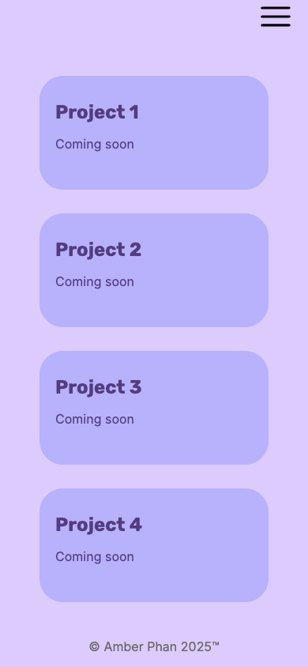
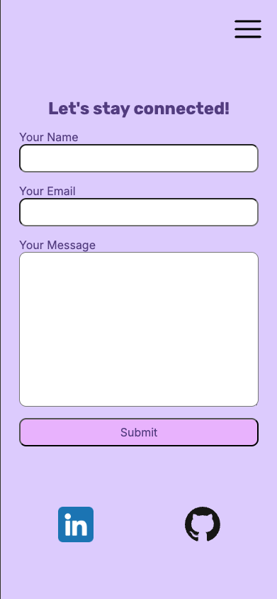
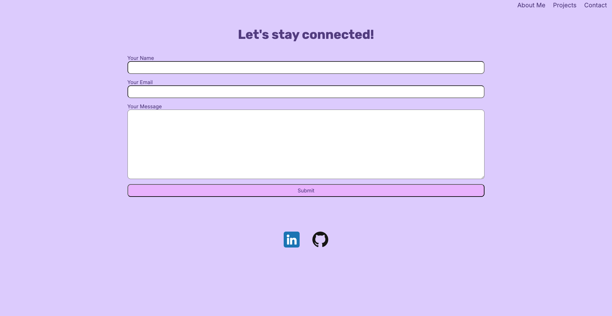
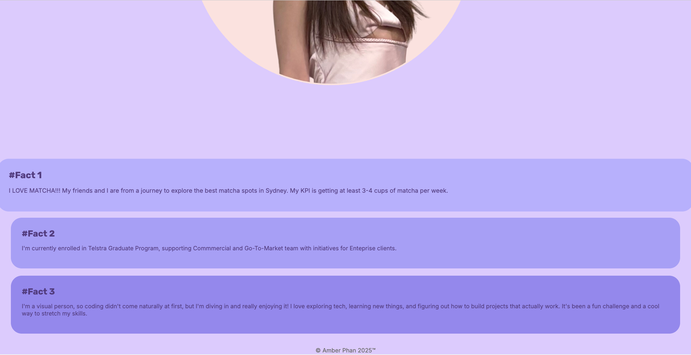
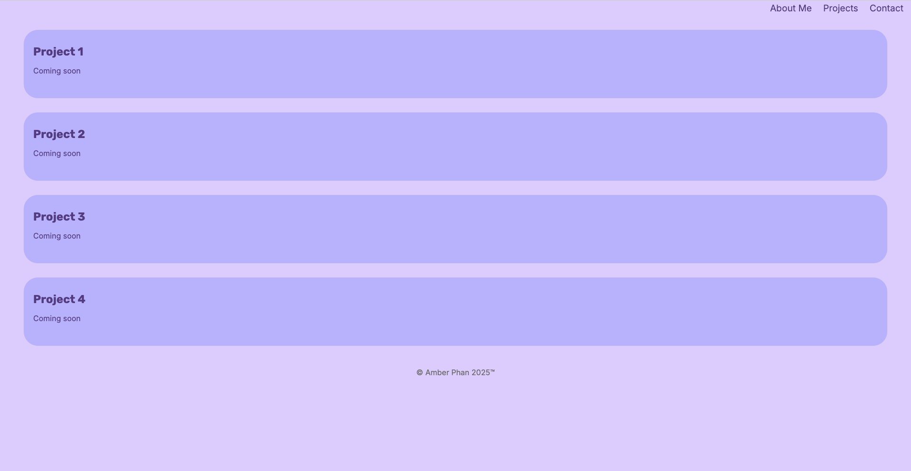
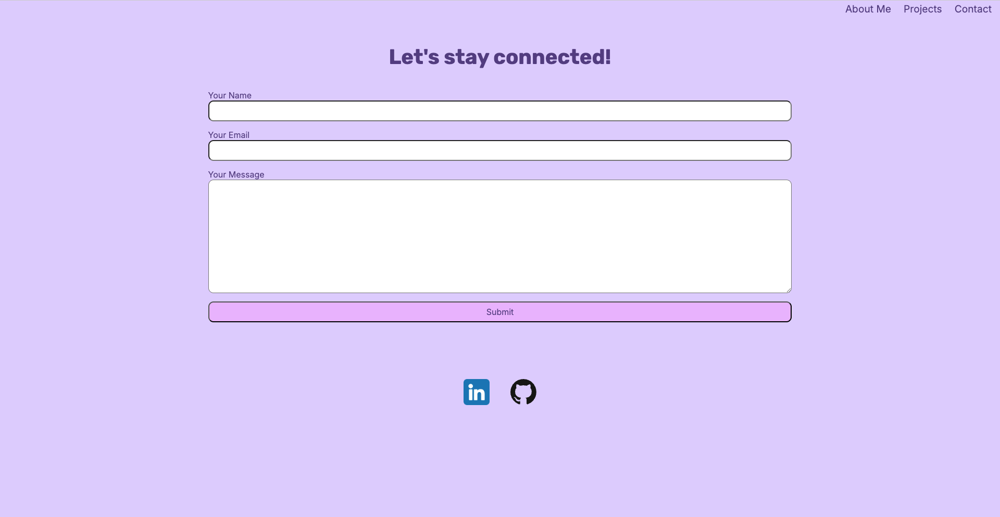

#  your_name_here - Portfolio Task
​
[My portfolio site](https://amberberphan.github.io/index.html)
​
## Project Requirements

### Content
 Add a short paragraph describing the features below. What aesthetic and technical choices did you make?
 
 My portfolio includes a profile picture, a short biography, a Projects section, and a functional contact form. I also linked my GitHub and LinkedIn. I aimed for a friendly look with soft pastel colors with purple as a dominant colour. 
- [x] At least one profile picture
- [x] Biography (at least 100 words)
- [x] Functional Contact Form
- [x] "Projects" section
- [x] Links to external sites, e.g. GitHub and LinkedIn.
​
### Technical
 Add a short paragraph describing the features below. What strategies or design decisions did you work from? 
 
 The site has multiple pages, uses semantic HTML, and is responsive on mobile and desktop. It’s version controlled with Git, deployed on GitHub Pages. The design decisions were referenced by the first website we made for Shecodes and some other basic html/css websites.
- [x] At least 2 web pages.
- [x] Version controlled with Git
- [x] Deployed on GitHub pages.
- [x] Implements responsive design principles.
- [x] Uses semantic HTML.

### Bonus (optional)
 Add a short paragraph describing the features below, if you included any. 
- [x] Different styles for active, hover and focus states. (Amber's note: I only added effect on hover for About Me and Project pages)
​
### Screenshots

Mobile View

####  About Me

####  Projects

####  Contact

Desktop View

####  About Me

####  Projects

####  Contact

